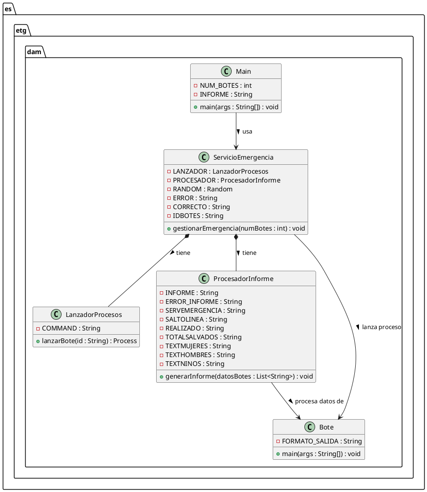

🚢 Proyecto Titanic – Servicio de Emergencias
üë• Integrantes del proyecto
David Hoyas
José Antonio [Apellido]

---

🧭 Índice
[An√°lisis del problema](#an√°lisis-del-problema)
[Diseño de la solución](#diseño-de-la-solución)
[Arquitectura](#arquitectura)
[Componentes](#componentes)
[Protocolo de comunicación](#protocolo-de-comunicación)
[Plan de pruebas](#plan-de-pruebas)
[Manual de usuario](#manual-de-usuario)
[Elementos destacables del desarrollo](#elementos-destacables-del-desarrollo)
[Problemas encontrados](#problemas-encontrados)
[Conclusiones individuales](#conclusiones-individuales)
[Anexos](#anexos)

---

An√°lisis del problema (5%)
El hundimiento del Titanic provocó una situación de emergencia con múltiples botes salvavidas.
Cada bote debía comunicar al servicio de emergencias el número de personas rescatadas.

El problema a resolver consiste en simular esta situación con procesos independientes, donde:
Cada bote se ejecuta como un proceso autónomo.
Cada uno tarda entre 2 y 6 segundos en realizar su conteo.
El servicio central recibe la información de cada bote y genera un informe final en formato Markdown con el recuento global.

El objetivo principal no es solo calcular los totales, sino practicar la creación y gestión de procesos en Java, junto con la comunicación entre procesos y la generación de informes.

---
---

üß™ Plan de pruebas (3%)
Pruebas unitarias
Clase Bote
Verifica que los valores generados sean v√°lidos (total entre 10 y 100).
Comprueba que la suma de mujeres + hombres + niños sea igual al total.
Comprueba que la constante FORMATO_SALIDA es correcta.

Pruebas funcionales
Ejecutar el proyecto y verificar que:
Se lanzan 20 botes.
Cada bote tarda entre 2 y 6 segundos.
El archivo Informe.md se genera correctamente.
La suma total de personas coincide con la suma de todos los botes.

Pruebas de integración
Validar que el ServicioEmergencias gestiona correctamente todos los procesos sin errores ni bloqueos.

---

üìò Manual de usuario (0%)
Ejecutar el programa desde la clase Main.java.
Esperar a que se generen todos los botes (ver√°s mensajes en consola).
Al finalizar, se creará el archivo Informe.md en la raíz del proyecto.
Abrir Informe.md para ver los resultados en formato legible.

---
üí° Elementos destacables del desarrollo (5%)
Uso de procesos reales en lugar de hilos.
Generación de informes Markdown.
Diseño modular dividido en clases especializadas.
Simulación realista de tiempos aleatorios de ejecución.
Integración con JUnit para las pruebas unitarias.

---

⚠️ Problemas encontrados (5%)
Dificultad inicial al coordinar procesos sin usar hilos (Thread).
Condiciones de carrera al intentar leer los datos antes de que los procesos terminasen.
Manejo de las rutas de ejecución del comando java -cp en distintos sistemas operativos.
Adaptación de los tests unitarios para una clase sin getters ni setters personalizados.

---
üìé Anexos (0%)
Código fuente completo: github.com/DavidHoyas/titanic_davidhoyas_joseantonio
Archivos generados: Informe.md
Herramientas utilizadas:
Java 17
JUnit 5
Lombok
Maven

---
🏗️ Arquitectura (6%)
Flujo general:
Main crea una instancia de ServicioEmergencias.
Este utiliza LanzadorProcesos para ejecutar los botes como procesos.
Cada Bote genera su salida y termina.
ServicioEmergencias recoge la información y la pasa a ProcesadorInforme.
Se genera el informe Informe.md.

---

⚙️ Componentes (4%)
Main.java
Punto de entrada.
Llama a los métodos del servicio principal.

ServicioEmergencias.java
Coordina los lanzamientos de procesos.
Espera los resultados y los envía al procesador.

LanzadorProcesos.java
Ejecuta un proceso externo con Runtime.getRuntime().exec()
Se encarga de construir el comando Java.

Bote.java
Proceso independiente.
Genera los datos aleatorios y los imprime por salida est√°ndar.

ProcesadorInforme.java
Lee los resultados recibidos.
Construye el informe final en formato Markdown.

---

🔗 Protocolo de comunicación (2%)
La comunicación entre procesos se realiza mediante la salida estándar (stdout).

Cada bote imprime una línea con el siguiente formato:
ID;Total;Mujeres;Hombres;Niños
El proceso principal (ServicioEmergencias) lee esta salida con un BufferedReader conectado al InputStream del proceso hijo.

Ejemplo:
B01;72;30;28;14
Ôªø
---
## Diagrama UML del proyecto

```plantuml
@startuml
package "es.etg.dam" {

    class Main {
        +main(args : String[]) : void
        -NUM_BOTES : int
        -INFORME : String
    }

    class ServicioEmergencia {
        +gestionarEmergencia(numBotes : int) : void
        -LANZADOR : LanzadorProcesos
        -PROCESADOR : ProcesadorInforme
        -RANDOM : Random
        -ERROR : String
        -CORRECTO : String
        -IDBOTES : String
    }

    class LanzadorProcesos {
        +lanzarBote(id : String) : Process
        -COMMAND : String
    }

    class ProcesadorInforme {
        +generarInforme(datosBotes : List<String>) : void
        -INFORME : String
        -ERROR_INFORME : String
        -SERVEMERGENCIA : String
        -SALTOLINEA : String
        -REALIZADO : String
        -TOTALSALVADOS : String
        -TEXTMUJERES : String
        -TEXTHOMBRES : String
        -TEXTNINOS : String
    }

    class Bote {
        +main(args : String[]) : void
        -FORMATO_SALIDA : String
    }

    ' Relaciones
    Main --> ServicioEmergencia : usa >
    ServicioEmergencia *-- LanzadorProcesos : tiene >
    ServicioEmergencia *-- ProcesadorInforme : tiene >
    ServicioEmergencia --> Bote : lanza proceso >
    ProcesadorInforme --> Bote : procesa datos de >
}
@enduml
```
