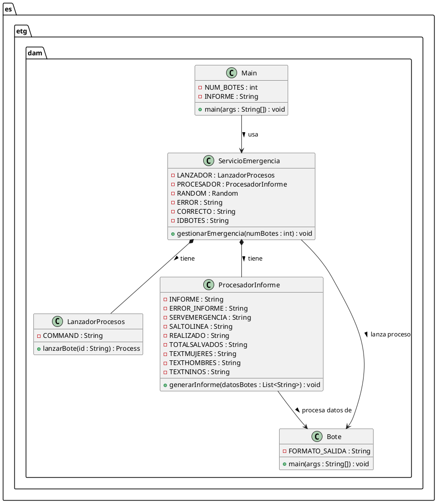

# Proyecto Titanic

## Integrantes del proyecto

David Hoyas
José Antonio Sancha

---

## Índice

[Análisis del problema](#análisis-del-problema)
[Diseño de la solución](#diseño-de-la-solución)
[Arquitectura](#arquitectura)
[Componentes](#componentes)
[Protocolo de comunicación](#protocolo-de-comunicación)
[Plan de pruebas](#plan-de-pruebas)
[Manual de usuario](#manual-de-usuario)
[Elementos destacables del desarrollo](#elementos-destacables-del-desarrollo)
[Problemas encontrados](#problemas-encontrados)
[Conclusiones individuales](#conclusiones-individuales)
[Anexos](#anexos)

---

## Análisis del problema

El problema consiste en simular un servicio de emergencias que coordina el rescate de personas gestionando 20 botes salvavidas de forma autónoma.
Cada bote genera un número aleatorio de pasajeros y tarda entre 2 y 6 segundos en realizar su recuento, informando después al servicio central.
El sistema debe procesar la información recibida y generar un informe en formato Markdown con los datos de cada bote y el total global.
Se requiere manejar la concurrencia y sincronización entre procesos, asegurando que todos los botes finalicen antes de crear el informe.
El programa debe reflejar correctamente el número de mujeres, hombres y niños rescatados por bote. El principal objetivo es la coordinación entre procesos independientes y la correcta agregación de los resultados.
En definitiva, el proyecto busca representar de forma ordenada y concurrente la gestión de una emergencia marítima.

---

## Plan de pruebas

### Pruebas unitarias

Clase Bote
Verifica que los valores generados sean válidos (total entre 10 y 100).
Comprueba que la suma de mujeres + hombres + niños sea igual al total.
Comprueba que la constante FORMATO_SALIDA es correcta.

### Pruebas funcionales

Ejecutar el proyecto y verificar que:
Se lanzan 20 botes.
Cada bote tarda entre 2 y 6 segundos.
El archivo Informe.md se genera correctamente.
La suma total de personas coincide con la suma de todos los botes.

### Pruebas de integración

Validar que el ServicioEmergencias gestiona correctamente todos los procesos sin errores ni bloqueos.

---

## Manual de usuario

- Ejecutar el programa desde la clase Main.java.
- Esperar a que se generen todos los botes (verás como se van generando los botes uno a uno en consola).
- Al finalizar, se creará el archivo Informe.md en la carpeta **resources** del proyecto.
- Abrir Informe.md para ver los resultados en formato legible.

---

## Elementos destacables del desarrollo

- Uso de procesos reales en lugar de hilos.
- Generación de informes Markdown.
- Diseño modular dividido en clases especializadas.
- Simulación realista de tiempos aleatorios de ejecución.
- Integración con JUnit para las pruebas unitarias.

---

## Problemas encontrados

- Dificultad inicial al coordinar procesos sin usar hilos (Thread).
- Condiciones de carrera al intentar leer los datos antes de que los procesos terminasen.
- Manejo de las rutas de ejecución del comando java -cp en distintos sistemas operativos.
- Adaptación de los tests unitarios para una clase sin getters ni setters personalizados.

---

## Arquitectura

```
- titanic_davidhoyas_joseantonio
  - src
    - main
      - java
        - es/etg/dam
          - Bote.java
          - LanzadorProcesos.java
          - Main.java
          - ProcesadorInforme.java
          - ServicioEmergencia.java
      - resources
        - Informe.md 
    - test
      - java
        - es/etg/dam
          - BoteTest.java
          - LanzadorProcesosTest.java
          - ServicioEmergenciaTest.java
  - .gitignore
  - pom.xml
  - README.md
```

---

## Componentes
- Main.java
  - Punto de entrada.
  - Llama a los métodos del servicio principal.

- ServicioEmergencias.java
  - Coordina los lanzamientos de procesos.
  - Espera los resultados y los envía al procesador.

- LanzadorProcesos.java
  - Ejecuta un proceso externo con Runtime.getRuntime().exec()
  - Se encarga de construir el comando Java.

- Bote.java
  - Proceso independiente.
  - Genera los datos aleatorios y los imprime por salida estándar.

- ProcesadorInforme.java
  - Lee los resultados recibidos.
  - Construye el informe final en formato Markdown.

---

## Protocolo de comunicación

La comunicación entre procesos se realiza mediante la salida estándar (stdout). Cada bote imprime una línea con el siguiente formato:

**ID, Total, Mujeres, Hombres, Niños**

El proceso principal (ServicioEmergencias) lee esta salida con un BufferedReader conectado al InputStream del proceso hijo.

Ejemplo:

**ID (B01), Total (72), Mujeres (30), Hombres (28), Niños (14)**

---

## Diagrama UML del proyecto




---

## Anexos

URL: [titanic_davidhoyas_joseantonio](https://github.com/DavidHoyas/titanic_davidhoyas_joseantonio)
Archivos generados: Informe.md
Herramientas utilizadas:
- Java 17
- JUnit 5
- Lombok
- Maven